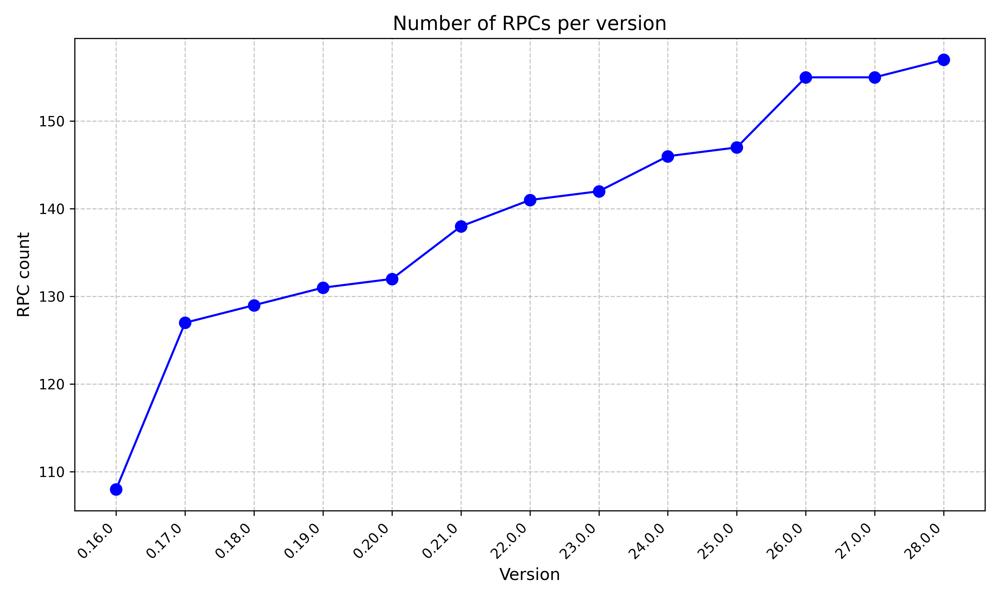

+++
date = 2025-01-24
draft = false
type = "blog"
title = "Bitcoin Core project direction"
description = "What should be the vision and long term goals for the Bitcoin Core project?"
weight = 10
author = "Antoine Poinsot"
tags = ["Bitcoin", "Bitcoin Core"]
+++

What should be the mid to long term goals of the project?

This is something i've been thinking about and discussing with others for a while. I don't quite
have finished thoughts about this, but i think it's important to discuss. It's also a good time as
most of us will meet in person soon.

A lot of decisions we make now about what features should go in, which should be prioritized, what
to review, what is valuable to start working on, are dependent on what we expect to happen in the
future. However, we currently cannot have any expectations about what will or will not happen in the
future. This significantly hinders our ability to make progress.

I think we are in this situation where everybody is working on their own thing and there is no broad
agreement about what the scope of the project should even be. As a consequence, year after year we
keep piling up more code, more features, more RPCs, etc.. with at best a constant amount of
competent reviewers' time. This is not tenable, as a focus which gets further dispersed will
inevitably lead to reduced overall software quality.

In addition there is a lot of wishful thinking. At a larger level, in the form "Bitcoin Core SHOULD
definitely feature X" with no consideration whatsoever about the tradeoffs. At a smaller level, as
we've seen with the priority projects degenerating into people voting about what others should spend
their time on. And finally at a local pull-request level. Any contributor will know about these PRs
that nobody NACKs although they aren't going anywhere because people have looked into it and don't
think this is a good idea. But seldom would someone say it out loud as they'd bear the cost for
everyone else, despite it being a net benefit with regard to project-wide resource allocation.  We
all wish someone else would do it for us, or that the author would magically lose interest and work
on more important things. Or even that this SHOULD happen, oh, yes, definitely SHOULD happen, but
others should carry the burden of review, maintenance and responsibility. Or its variant "oh yes
i'll help, absolutely, just not right now, maybe next decade". Being enthusiastic to people's idea
is well-intentioned, and not saying no is the comfortable thing to do.  Unfortunately it also has
negative consequences, both direct and indirect. When making decisions about where to take the
project we need to discuss "should" as bounded by "can" -and **not** "could"- or we'll stay stuck in
this untenable position.

At this point you may think this is not specific to Bitcoin Core, that it's the fate of any open
source project with no Benevolent Dictator, the Cathedral vs the Bazaar, all that. But it's not
because there is no hierarchy that we can't be more efficient. That we can't decide of a direction
for the project. Finding broad agreement on a few guiding principles for what Bitcoin Core should be
will help determine what should or should not happen at all. It's also the basis to form rough
consensus on concrete goals to set ourselves, which in turn can go a long way in prioritizing
development.

Aligning ourselves on a set of specific goals for the project helps gather support for making
uncomfortable decisions. For instance saying no to a feature someone invested time in developing, or
getting rid of legacy components. But it also enables us to resolve the coordination issue in making
things we decided should happen, actually happen. Compared to other open source projects in a
similar situation we have the immense advantage of disposing of substantial financial resources.
There are Bitcoin Core dev offices in New York, London, and soon, Amsterdam and San Francisco. For
instance, those could be used for a sprint if we think something that should happen cannot because
it did not get enough review from key contributors in this area. Setting clear goals would not only
help us fight against scope creep, it would enable us to make better use of the means at our
disposal.

We don't need a benevolent dictator for this to happen. We just need sufficient buy-in from active
contributors. This is up to us.
