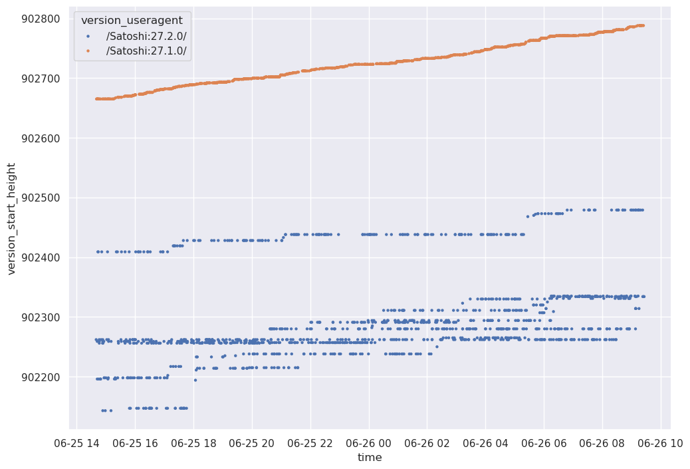

+++
date = 2025-09-05
draft = false
type = "blog"
title = "Misbehaving nodes investigation"
description = "An investigation into a few hundreds misbehaving publicly reachable nodes on the Bitcoin network"
weight = 10
author = "Antoine Poinsot"
tags = ["Bitcoin", "Bitcoin Core"]
+++

In late June 2025, Eric Voskuil reached out to me asking about a weird behaviour he had observerved
on the Bitcoin network. Libbitcoin had started dropping peers which advertized an excessively off
timestamp in their `version` message and they found that while most peers were within seconds, a
handful were off by small amounts and a large number was behind by up to 5100 minutes.  What's more,
all those peers were Bitcoin Core v27.1 or v27.2.

Now, to be clear, 5100 minutes is *a lot*. Bitcoin Core will reject block (headers) with a timestamp
more than 2 hours in the future. 5100 minutes is 3.5 days behind: a node with a local clock so
skewed will reject blocks when they are created. It would only catchup due to Bitcoin Core's
[stale tip detection logic][stale-tip-logic], 3.4 days later. Further, that *all* of them are
running specifically (outdated) versions 27.1 or 27.2 is quite odd.

I of course suspected spy nodes. But it was not a very satisfactory answer. Any surprising
behaviour could be attributed to a spy node, and i don't see any reason for a spy to tell everyone
their clock is days behind. And why would they alternate versions, but *only* between 27.1 and 27.2?
Clearly that didn't explained much. However Bitcoin Core [dropped network-adjusted time in
27.0][27-net-adjusted-time] and later [cleaned up][stickies-cleanup] the relevant logic in 28.0. I
figured it might be the case that a bug slipped through in the removal for 27 and was inadvertently
fixed when this logic was cleaned up in 28. And the fact that we only noticed this bug for 27.1 and
27.2 nodes would be simply that all 27.0 nodes had upgraded to patch releases. That seemed pretty
unlikely, but was the best hunch i could come up with off the top of my head.

A couple days later, Eric comes back with another oddity. This time, he notices a bunch of nodes
that don't honour the `version` message's relay flag. The `relay` flag instructs a node whether it
should announce transactions to the sender of the `version` message. Not respecting this flag is a
protocol violation and will result in a disconnection, in Bitcoin Core or Libbitcoin alike. In
Eric's experiment Libbitcoin would always set `relay` to `false` and yet those peers would still
announce it transactions. All of the misbehaving peers were Bitcoin Core version 25.0 or 25.1 (but
never 25.2!). Again, weird. The announced transactions traffic appeared to be organic, it wasn't
someone trying to exploit something.

In both cases, these are nodes that are misbehaving but don't appear to be particularly malicious.
In both cases, the malicious nodes claim to be some outdated Bitcoin Core version, and in at least
one of these cases we know it's not true (Bitcoin Core will always honour the `relay` flag). Was it
some script kiddy who modified a Bitcoin Core client without knowing what he's doing? That seems
highly unlikely as that's 4 different versions and **hundreds** of nodes in total. Some proxy
spoofing the `version` message of a Bitcoin Core node? For what purpose?

At this point my guesswork was hitting a wall, so i asked Eric for a sample of the specific IPs
exposing this behaviour. Upon receiving the sample, trying to connect to a couple of those IPs using
a Bitcoin Core node did not expose this behaviour. I reported back to Eric, hinting that it must be
a bug in his implementation. After further testing Eric found out that the time reported by these
nodes was cycling between different values, a correct ones and a few skewed ones. "Almost like it's
4 nodes." Hmm. By repeatedly connecting to those nodes, it was possible to observe the same
behaviour with Bitcoin Core. I decided to start writing a script which would repeatedly connect to
these IPs and collect their `version` messages.

I brought this up over lunch at [Chaincode][chaincode], as well as to Bitcoin's Chief Data Enjoyer,
[@0xb10c][b10c]. Pieter analyzed my IPs sample and remarked they virtually all belonged to the same
[AS][as], [AS401199][as-bitproject] dubbed "Bitprojects". "Looks like pretty much 4 full /24's."
Hmm. Meanwhile, @0xb10c shared some historical data he had about `start_height`, which was equally
off. Interestingly, it made clear the divide between skewed clock / height and not was also between
versions. He also mentioned that somebody else had reached out to him about these IPs, not because
of the time offset but because the person noticed one of them took 13s to reply to a `GETDATA`.
Finally, he had also noticed the cycling behaviour:

> I looked a bit more at my data, and it seems that if you connect to an IP twice, you might reach a
> different node from time to time. At least it gives you a singificantly different start_height and
> timeoffset.



At this point it became clear [Bitprojects][bitprojects-website] was running misconfigured nodes
with some sort of broken proxy in front of them. Most likely it was related to their "anycast
hosting" service. I initially considered they may be running for each IP one correctly configured
node and several misconfigured ones. But this wouldn't explain how they fail to honour the `relay`
flag in version messages. Or set `NODE_NETWORK` even for pruned nodes (another misbehaviour Eric
noticed). So they must have some sort of buggy middleware in-between? It actually turned out that
the set of IPs with skewed clocks and the set of IPs sending incorrect version messages were
disjoint. I focused on the skewed clocks for now, the rest is a mystery for another day. To learn
more about how they exactly screwed up the timestamp and height, i ran a Script which would connect
8 times in a row to every Bitprojects IP. For each connection it would collect the announced time
and start height.

I ran this Script around block height `902950`. In total i received 2951 version messages with a
correct block height, 379 messages for block height `902577` (about 2 days and a half behind), 347
messages for block height `902446` (about 3 days and a half behind), 395 messages for height
`902440`, 388 messages for height `902435`, 354 messages for height `902425`, 363 for height
`902409`, 408 messages for height `902403`, and a few outliers. The timestamps received essentially
matched those values. Looking at the specific values returned per IP, although their behaviour
wasn't perfectly consistent, there was a clear pattern of returning a correct value about half the
time, and when it's skewed half the time it's about 2 days behind and the rest of the time about 3
days behind. Here is an excerpt:

```
IP 203.11.72.225: 8 version messages
        Time '2025-06-27T10:55:12': 4 version messages
        Time '2025-06-24T01:06:34': 2 version messages
        Time '2025-06-25T05:33:20': 1 version messages
        Time '2025-06-23T22:08:14': 1 version messages
        Height 902950: 4 version messages
            2025-06-27T10:55:12
            2025-06-27T10:55:54
            2025-06-27T10:56:34
            2025-06-27T10:57:28
        Height 902425: 2 version messages
            2025-06-24T01:06:34
            2025-06-24T01:07:54
        Height 902577: 1 version messages
            2025-06-25T05:33:20
        Height 902440: 1 version messages
            2025-06-23T22:08:14

IP 203.11.72.226: 8 version messages
        Time '2025-06-27T10:55:06': 5 version messages
        Time '2025-06-23T22:08:33': 2 version messages
        Time '2025-06-25T05:34:40': 1 version messages
        Height 902950: 5 version messages
            2025-06-27T10:55:06
            2025-06-27T10:55:28
            2025-06-27T10:55:54
            2025-06-27T10:56:14
            2025-06-27T10:56:54
        Height 902435: 1 version messages
            2025-06-23T22:08:33
        Height 902440: 1 version messages
            2025-06-23T22:08:14
        Height 902577: 1 version messages
            2025-06-25T05:34:40

IP 203.11.72.227: 8 version messages
        Time '2025-06-27T10:55:12': 4 version messages
        Time '2025-06-23T22:08:13': 2 version messages
        Time '2025-06-24T01:15:23': 1 version messages
        Time '2025-06-25T05:34:01': 1 version messages
        Height 902950: 4 version messages
            2025-06-27T10:55:12
            2025-06-27T10:55:29
            2025-06-27T10:55:54
            2025-06-27T10:57:07
        Height 902435: 1 version messages
            2025-06-23T22:08:13
        Height 902403: 1 version messages
            2025-06-24T01:15:23
        Height 902577: 1 version messages
            2025-06-25T05:34:01
        Height 902446: 1 version messages
            2025-06-23T22:13:27

IP 203.11.72.228: 8 version messages
        Time '2025-06-27T10:55:12': 5 version messages
        Time '2025-06-24T01:15:24': 2 version messages
        Time '2025-06-25T05:34:01': 1 version messages
        Height 902950: 5 version messages
            2025-06-27T10:55:12
            2025-06-27T10:55:34
            2025-06-27T10:55:49
            2025-06-27T10:56:14
            2025-06-27T10:57:34
        Height 902403: 2 version messages
            2025-06-24T01:15:24
            2025-06-24T01:16:02
        Height 902577: 1 version messages
            2025-06-25T05:34:01
```

I eventually reached out to the Bitprojects maintainer, who was very responsive. They let me know
the misbehaviour was due to a clock misconfiguration, and the nodes running out of resources. They
said they would immediately pause the nodes until they can reconfigure them properly.

[27-net-adjusted-time]: https://bitcoincore.org/en/releases/27.0/#p2p-and-network-changes
[stale-tip-logic]: https://github.com/bitcoin/bitcoin/blob/5ad79b203505fe7b867c05139d78e9aa6d662dcc/src/net_processing.cpp#L5241-L5266
[stickies-cleanup]: https://github.com/bitcoin/bitcoin/pull/29623
[b10c]: https://b10c.me
[chaincode]: https://chaincode.com/
[as]: https://en.wikipedia.org/wiki/Autonomous_system_%28Internet%29
[as-bitproject]: https://www.peeringdb.com/net/37635
[bitprojects-website]: https://bitprojects.io/index.html
